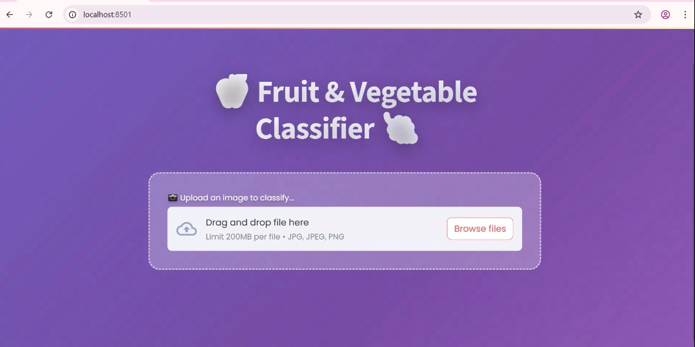

# Fruit Classification Using CNN

A deep learning project that uses **Convolutional Neural Networks (CNNs)** to classify **36 different fruit types** from images.  
The system is trained on a curated dataset and deployed as an interactive **Streamlit web application** for real-time fruit recognition.

---

## 📌 Project Overview

This project implements a CNN-based image classification model capable of identifying fruit types from images.  
The dataset contains **36 fruit classes**, with training and testing sets pre-organized.  
The model is trained using **TensorFlow/Keras** and deployed with **Streamlit** for easy user interaction.

**Example Fruit Classes:**
- Apple Braeburn  
- Avocado  
- Banana  
- Blueberry  
- Pineapple  
*(and 31 more...)*

---

## 📂 Dataset

- **Total Classes:** 36
- **Format:** JPG/PNG
- **Preprocessing:** Images resized to 224x224 pixels, normalized, and augmented during training
- **Source:** Custom/collected dataset
- Organized:
  - `train/` – images for model training
  - `test/` – images for evaluation

---

## 🛠 Tech Stack

- **Python**
- **TensorFlow / Keras**
- **NumPy, Pandas, Matplotlib**
- **Streamlit** (for deployment)
- **CNN architecture** for multi-class classification

---

## 🚀 Features

- Classifies 36 fruit types from images
- Real-time predictions with confidence scores
- Drag-and-drop image upload interface (via Streamlit)
- Image preprocessing and augmentation for better accuracy
- Model visualization (accuracy/loss curves, confusion matrix)

---

## 📷 Streamlit App Screenshots

**Upload & Prediction Interface**  


**Prediction Results with Confidence Scores**  


---

## 📦 Installation

Clone the repository:
```bash
git clone https://github.com/yourusername/Fruit_Classification_Using_CNN.git
cd Fruit_Classification_Using_CNN
